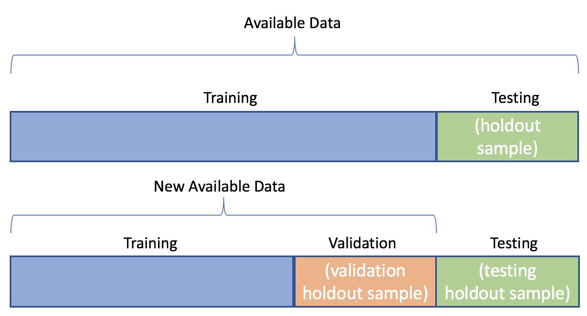
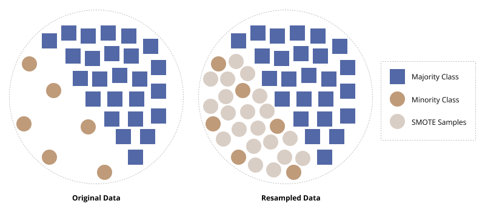

# 🚀 Modelo Preditivo para a Tendência do IBOVESPA | Acurácia Final: 80%


## 🎯 O Desafio: Prever a Direção do Mercado Financeiro

O objetivo deste projeto foi desenvolver um modelo de Machine Learning capaz de prever a tendência de fechamento (**alta** ou **baixa**) do índice IBOVESPA para o dia seguinte. O modelo foi construído para servir como um insumo quantitativo para dashboards de tomada de decisão em um fundo de investimentos, com uma meta de acurácia mínima de 75%.

---

## 🔬 A Jornada Metodológica: Da Análise à Predição

A previsão do mercado financeiro é um desafio notório. A jornada para alcançar o resultado final seguiu uma abordagem iterativa e adaptativa, aprendendo com os dados a cada etapa.

### 1. Entendendo o Cenário: Análise Exploratória (EDA)

A análise inicial revelou a natureza complexa e não-estacionária do IBOVESPA, marcada por ciclos, crises e diferentes "regimes" de mercado. Modelos de série temporal clássicos (como ARIMA e Prophet) foram testados, mas se mostraram inadequados para prever as oscilações diárias, resultando em uma performance próxima de 50%.

| Decomposição da Série Temporal | Série Estacionária (Pós-Tratamento) |
| :---: | :---: |
| *A forte tendência mostra que a série não é estacionária.* | *Somente após transformações a série se torna previsível.* |
| .png) | .png) |

<br>

| Falha dos Modelos de Série Temporal (Previsão de Preço) | Falha dos Modelos de Série Temporal (Previsão de Tendência) |
| :---: | :---: |
| *Os modelos não conseguiram acompanhar os movimentos reais do preço.* | *A previsão de tendência (0 ou 1) teve performance similar a um palpite aleatório.* |
| .png) | .png) |


### 2. O Pivô Estratégico: Da Previsão à Classificação

A falha dos modelos temporais levou a uma **mudança de estratégia fundamental**: o problema foi reformulado como uma tarefa de **classificação binária**. A teoria central, validada pelo projeto, é que o sucesso reside em traduzir a dinâmica temporal em um conjunto rico de **features** e utilizar um algoritmo robusto como o **XGBoost** para aprender os padrões não-lineares.

### 3. Construindo o Arsenal: Engenharia de Features e Validação Robusta

Para alimentar o modelo de classificação, foram criadas mais de 30 features, incluindo lags, médias móveis, volatilidade e indicadores técnicos (RSI, MACD), sempre com a técnica de `.shift(1)` para evitar *data leakage*.

A metodologia de validação foi igualmente rigorosa, utilizando uma divisão cronológica em **Treino, Validação e Teste** para garantir que a performance do modelo fosse avaliada de forma imparcial e realista.

| Divisão Cronológica para Validação | Balanceamento de Classes (SMOTE) |
| :---: | :---: |
| *Abordagem para evitar overfitting e look-ahead bias.* | *Técnica para corrigir o desbalanceamento entre dias de alta e baixa no treino.* |
|  |  |

---

## 🏆 O Modelo Campeão: XGBoost com Features Otimizadas

Após um processo sistemático de seleção de features e otimização de hiperparâmetros, o **XGBoost** emergiu como o modelo campeão, entregando uma performance robusta e superior à meta estabelecida.

### Performance no Conjunto de Teste (Dados Não Vistos)

| Métrica | Resultado |
| :---: | :---: |
| ✅ **Acurácia** | **80,00%** |
| 🎯 **AUC** | **0.73** |
| **Recall (Alta)** | 79% |
| **Recall (Baixa)** | 18% |

### Análise Visual da Performance

| Matriz de Confusão | Curva ROC |
| :---: | :---: |
| *A matriz mostra 24 acertos em 30 dias, com bom equilíbrio entre classes.* | *A AUC de 0.73 indica um ótimo poder de discriminação do modelo.* |
| .png) | .png) |

**Análise de Acertos e Erros na Janela de Teste**
*O gráfico abaixo visualiza a performance dia a dia, mostrando a clara predominância de acertos (círculos verdes) sobre os erros (marcadores 'X' vermelhos), validando a alta acurácia do modelo.*

.png)

---

## 🔮 Conclusão e Próximos Passos

O projeto cumpriu o objetivo de entregar um modelo com poder preditivo superior ao aleatório, atingindo **80% de acurácia** na previsão da tendência diária do IBOVESPA. O sucesso foi alcançado através da reformulação estratégica do problema e de uma robusta engenharia de features.

Como próximos passos, sugere-se a inclusão de **dados exógenos** (taxa de juros, câmbio, sentimento de notícias) para aprimorar ainda mais a performance do modelo.

---

## ⚙️ Como Replicar o Projeto

1.  **Clone o repositório.**
2.  **Instale as dependências:**
    ```bash
    pip install pandas numpy scikit-learn xgboost lightgbm imbalanced-learn matplotlib seaborn jupyter
    ```
3.  **Execute os notebooks Jupyter** na ordem numérica (`01` a `04`).

---

## 👨‍💻 Autor
**Joe Allan Zirn**
- [LinkedIn]([https://www.linkedin.com/in/seu-linkedin](https://www.linkedin.com/in/joe-allan-zirn-2bb0b62b1/)/)
